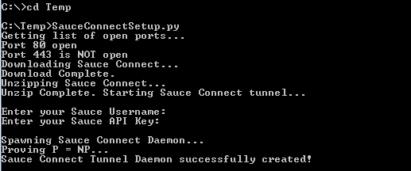

SauceConnectSetup.py
=================
A little Python script that automatically installs and sets up the Sauce Connect Java Utility tunnel.

How it works:
---------------

This little Python script simply:
 - Download the Sauce Connect Java Utility from: http://saucelabs.com/downloads/Sauce-Connect-latest.zip
 - Unzips the download
 - Sets up the Sauce Connect Java Utility automatically. During setup the script:
   - Checks for the required open ports 80 & 443
   - Asks for the Sauce username & API Key
   - Kicks off the Java utility with the authentication information as a daemon
 - The script kills the daemon nightly at 12am and redeploys the tunnel, to ensure Sauce is kept fresh.

How to run:
---------------

Prerequisite: Python 2.7.4+ installed

To run this script, open a command prompt as Administrator, cd to the folder you downloaded the script, and execute the script:

  >SauceConnectSetup.py

or depending on your PATH variable and how your system handles .py file extensions:

  >python SauceConnectSetup.py

Example Screenshots:
---------------
> **A successful run of the script:**

]

> **A successful tunnel connection to a Sauce machine:**

> **A successful redelpoyment of the daemon at midnight:**

> **The Sauce connection haults, boots, and redeploys all before 12:00:30am:**

